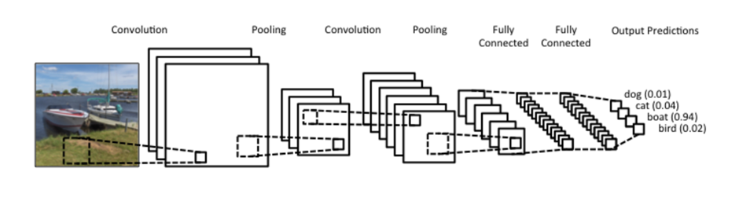

# Cat-Dog-Classification-Using-CNN

## About CNN

A Convolutional Neural Network (ConvNet/CNN) is a Deep Learning algorithm which can take in an input image, assign importance (learnable weights and biases) to various aspects/objects in the image and be able to differentiate one from the other. The pre-processing required in a ConvNet is much lower as compared to other classification algorithms.

## Libraries used: 
<ul>
<li>keras</li>
<li>numpy</li>
<li>matplotlib</li>
<li>opencv</li>
</ul>
